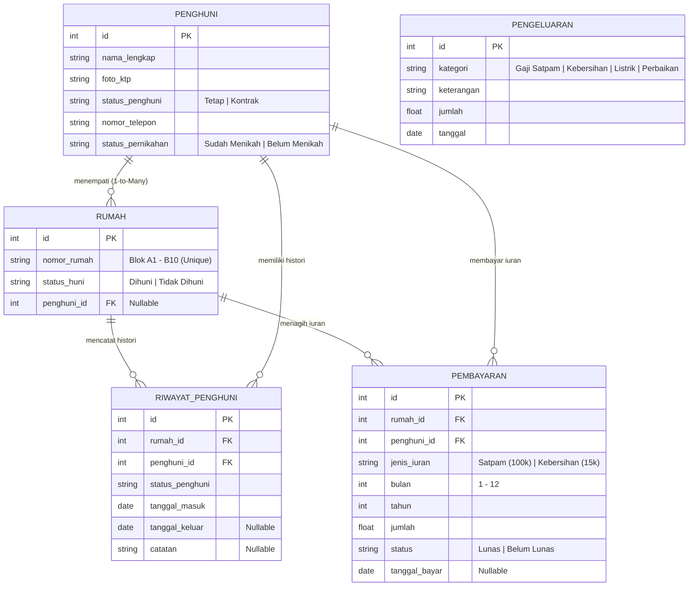

# System-RT — Aplikasi Manajemen Administrasi & Keuangan RT (Vite + React SPA)

<div align="left">

[](https://system-rt-zalde.vercel.app/)
[](https://github.com/alberic13/system-rt/actions)
[](https://github.com/alberic13/system-rt)
[](https://react.dev/)
[](https://tailwindcss.com/)

</div>

Aplikasi web modern Single Page Application (SPA) berbasis **Vite**, **React 19 (JSX)**, **Tailwind CSS v4**, **React Router DOM**, dan **LocalStorage Data Engine**.

🌐 **Live Demo URL**: [https://system-rt-zalde.vercel.app/](https://system-rt-zalde.vercel.app/)

---

## 📌 Studi Kasus & Tarif Iuran

Perumahan Elite terdiri dari **total 20 unit rumah** (15 rumah dihuni tetap & 5 rumah kontrak / sementara / kosong):
1. **Tarif Iuran Bulanan**:
   - **Iuran Satpam**: Rp 100.000 / bulan
   - **Iuran Kebersihan**: Rp 15.000 / bulan
2. **Aturan Penagihan**:
   - Penghuni Tetap: Ditagih rutin setiap bulan.
   - Rumah Kontrak / Sementara: Ditagih *hanya* jika terdapat penghuninya (Status Rumah **Dihuni**).
   - Opsi Pembayaran: Mendukung pembayaran rutin 1 bulan maupun **1 Tahun Sekaligus**.
3. **Pengeluaran RT**:
   - Rutin: Gaji 2 satpam (Rp 1.500.000/bln), Listrik pos satpam (Rp 150.000/bln).
   - Insidental: Perbaikan jalan, perbaikan selokan, perawatan taman, dll.

---

## 🗄️ Entity Relationship Diagram (ERD) & Skema Data

Berikut adalah visualisasi **Diagram Relasi Entitas (ERD)** dan skema relasi basis data yang diterapkan pada **System-RT** : 


```mermaid
erDiagram
    PENGHUNI {
        int id PK
        string nama_lengkap
        string foto_ktp
        string status_penghuni "Tetap | Kontrak"
        string nomor_telepon
        string status_pernikahan "Sudah Menikah | Belum Menikah"
    }

    RUMAH {
        int id PK
        string nomor_rumah "Blok A1 - B10 (Unique)"
        string status_huni "Dihuni | Tidak Dihuni"
        int penghuni_id FK "Nullable"
    }

    RIWAYAT_PENGHUNI {
        int id PK
        int rumah_id FK
        int penghuni_id FK
        string status_penghuni
        date tanggal_masuk
        date tanggal_keluar "Nullable"
        string catatan "Nullable"
    }

    PEMBAYARAN {
        int id PK
        int rumah_id FK
        int penghuni_id FK
        string jenis_iuran "Satpam (100k) | Kebersihan (15k)"
        int bulan "1 - 12"
        int tahun
        float jumlah
        string status "Lunas | Belum Lunas"
        date tanggal_bayar "Nullable"
    }

    PENGELUARAN {
        int id PK
        string kategori "Gaji Satpam | Kebersihan | Listrik | Perbaikan"
        string keterangan
        float jumlah
        date tanggal
    }

    PENGHUNI ||--o{ RUMAH : "menempati (1-to-Many)"
    RUMAH ||--o{ RIWAYAT_PENGHUNI : "mencatat histori"
    PENGHUNI ||--o{ RIWAYAT_PENGHUNI : "memiliki histori"
    RUMAH ||--o{ PEMBAYARAN : "menagih iuran"
    PENGHUNI ||--o{ PEMBAYARAN : "membayar iuran"
```

### 📋 Rincian Tabel Entitas & Atribut:

1. **`Penghuni` (Entitas Utama Warga)**:
   - `id` (PK, Int) — ID unik penghuni
   - `nama_lengkap` (String) — Nama lengkap warga
   - `foto_ktp` (String) — URL SVG/Base64 foto KTP terverifikasi
   - `status_penghuni` (String) — `Tetap` / `Kontrak`
   - `nomor_telepon` (String) — Nomor Kontak / WhatsApp
   - `status_pernikahan` (String) — `Sudah Menikah` / `Belum Menikah`

2. **`Rumah` (Entitas 20 Unit Hunian)**:
   - `id` (PK, Int) — ID unik unit rumah
   - `nomor_rumah` (String, Unique) — Nomor unit (Blok A1–A10 & B1–B10)
   - `status_huni` (String) — `Dihuni` / `Tidak Dihuni`
   - `penghuni_id` (FK, Nullable) — ID penghuni aktif menempati

3. **`RiwayatPenghuni` (Log Histori Hunian)**:
   - `id` (PK, Int) — ID log histori
   - `rumah_id` (FK, Int) — Relasi ke tabel `Rumah`
   - `penghuni_id` (FK, Int) — Relasi ke tabel `Penghuni`
   - `tanggal_masuk` & `tanggal_keluar` — Tanggal mulai & selesai huni (`null` jika masih aktif)
   - `catatan` (String, Nullable) — Catatan/keterangan pergantian penghuni

4. **`Pembayaran` (Log Pemasukan Iuran Warga)**:
   - `id` (PK, Int) — ID transaksi iuran
   - `rumah_id` & `penghuni_id` (FK) — Relasi unit rumah & penghuni
   - `jenis_iuran` (String) — `Satpam` (100k) / `Kebersihan` (15k)
   - `bulan` & `tahun` (Int) — Periode tagihan
   - `jumlah` (Float) — Nominal iuran
   - `status` (String) — `Lunas` / `Belum Lunas`

5. **`Pengeluaran` (Log Biaya RT)**:
   - `id` (PK, Int) — ID transaksi pengeluaran
   - `kategori` (String) — Gaji Satpam, Listrik, Kebersihan, Perbaikan
   - `jumlah` (Float) — Nominal biaya
   - `tanggal` (Date) — Tanggal transaksi

---

## ✨ Fitur Utama Aplikasi (React SPA)

1. **Mengelola Penghuni (`/penghuni`)**:
   - Tambah & Ubah data penghuni.
   - Atribut: Nama Lengkap, Foto KTP (dengan preview & uploader), Status (Tetap/Kontrak), Nomor Telepon, Status Pernikahan (Sudah Menikah/Belum Menikah).
2. **Mengelola Rumah & Riwayat (`/rumah`)**:
   - Tampilan List/Grid 20 Unit Rumah (Status: **Dihuni** / **Tidak Dihuni**).
   - Menghubungkan & mengubah penghuni rumah via modal **Atur Penghuni** (termasuk input `Catatan Riwayat`).
   - Pencatatan otomatis log histori `RiwayatPenghuni` saat pergantian warga (menutup tanggal keluar warga lama dan membuka tanggal masuk warga baru).
   - Modal **Riwayat** modern menampilkan timeline rekam jejak penghuni (Aktif/Terdahulu), periode huni, dan fitur hapus riwayat.
3. **Mengelola Pembayaran (`/pembayaran`)**:
   - Input pembayaran iuran Satpam (100k) & Kebersihan (15k).
   - Opsi pembayaran 1 Bulan atau Paket Lunas **1 Tahun Sekaligus**.
   - Matriks filter pembayaran per bulan, tahun, & jenis iuran.
4. **Mengelola Pengeluaran (`/pengeluaran`)**:
   - Catat pengeluaran kas RT rutin & insidental berdasarkan kategori, nominal, tanggal, & rincian deskripsi.
5. **Laporan Keuangan (`/laporan` & `/`)**:
   - **Grafik Tren Keuangan 1 Tahun** (Recharts): Menampilkan Pemasukan, Pengeluaran, & Akumulasi Saldo Sisa Kas RT.
   - Laporan Rekapitulasi Keuangan & detail rincian pemasukan/pengeluaran per bulan.
   - Fitur Cetak / Ekspor PDF Laporan Keuangan.

---

## 🛠️ Cara Menjalankan (Vite Dev Server)

```bash
cd c:/xampp/htdocs/system-rt
npm install
npm run dev
```

Buka browser di: `http://localhost:5173` atau port aktif yang ditampilkan.

---

## 🧪 Verifikasi & Kualitas Kode (CI/CD & Testing)

| Item Pengujian | Status | Rincian / Hasil Verifikasi |
| :--- | :---: | :--- |
| **Linting Test (Oxlint)** | ✅ **Passed** | `0 errors`, `0 warnings` pada 11 files (92 rules). Bebas dari dead code & missing hooks dependencies. |
| **Build Production (Vite)** | ✅ **Passed** | Bundle terkompilasi dalam **984ms** tanpa error bundling. |
| **CI/CD Pipeline** | ✅ **Active** | GitHub Actions Workflow (`.github/workflows/ci.yml`) otomatis memvalidasi lint & build di setiap push/PR. |
| **Live Deployment** | ✅ **Online** | [system-rt-zalde.vercel.app](https://system-rt-zalde.vercel.app/) |
| **Runtime Browser Test** | ✅ **Passed** | 0 JS console errors & 0 runtime exception pada seluruh 6 rute navigasi.. |
